# ⚡ LightGBM v8
###### Scalable gradient boosted decision tree (GBDT) framework to predict daily product-level sales for 40.000+ unique items.

<br/>

### **`⚡`** SUMMARY

Many improvements have been over the last couple stories. From improving the model, refactoring many steps of the framework, massively speeding up experimentation to implementing a better cross-validation and metric calculation setup. 

We have hit a milestone and we can start working on productionizing the current model. This does not imply development is finished, a lot of room is left for further improvements. Both in the area of feature engineering (improving current features + adding more feature sources such as pricing and marketing) as well as parameter optimization. Yet, current performance is very promising!

---

### **`⚡`** VALIDATION

First, we compare performance of the LightGBM model to our current baseline WA model. For the error metrics of interest, we compute summary statistics for the distribution of all products. Both the mean and the median is considered, clearly the mean is impacted more due to high outlying errors whereas the median is a more robust measure of centrality in case of an asymmetric distribution.

#### OVERALL LEVEL

In terms of overall error metrics LightGBM has better predictive performance than our current WA production baseline on every considered metric. This holds for both a daily and a weekly forecast.

###### TABLE 1: Error comparison on daily level over 40.000 products
|               | WA Baseline | LightGBM v8 | WA Baseline | LightGBM v8 |
|---------------|-------------|-------------|-------------|-------------|
| *Daily Error* | *Mean*      | *Mean*      | *Median*    | *Median*    |
| `Huber`       | 0.400       | 0.322       | 0.102       | 0.084       |
| `MAE`         | 0.633       | 0.518       | 0.329       | 0.261       |
| `MSE`         | 2.986       | 2.427       | 0.224       | 0.187       |
| `MAPE`        | 1.194       | 1.077       | 1.141       | 1.075       |
| `wMAPE`       | 1.954       | 1.461       | 1.553       | 1.354       |

###### TABLE 2: Error comparison on weekly level over 40.000 products
|                | WA Baseline | LightGBM v8 | WA Baseline | LightGBM v8 |
|----------------|-------------|-------------|-------------|-------------|
| *Weekly Error* | *Mean*      | *Mean*      | *Median*    | *Median*    |
| `Huber`        | 2.259       | 1.725       | 0.865       | 0.566       |
| `MAE`          | 2.625       | 2.078       | 1.273       | 0.946       |
| `MSE`          | 67.12       | 47.71       | 2.609       | 1.493       |
| `MAPE`         | 1.421       | 0.995       | 1.199       | 1.057       |
| `wMAPE`        | 1.351       | 0.967       | 0.931       | 0.746       |

Next, we compute the error per product and use it define an error ratio. This is formulated as dividing the WA error for product `i` by the LightGBM error for product `i`. This yields one ratio per product `i` in the dataframe. Now, the fraction of ratios that are larger than one corresponds to the fraction of products that are improved by the LightGBM model in comparison to our baseline.

###### TABLE 3: Percentage of products improved by considering error ratios 
|               | `Huber` | `MAE`  | `MSE`  | `MAPE` | `WMAPE` |
|---------------|---------|--------|--------|--------|---------|
| **Ratio > 1** | 83.79%  | 77.79% | 77.35% | 79.19% | 76.10%  |

Lastly, we can summarise and compare the distributions of the errors visually.

###### FIGURE 11: Boxplot comparison of daily errors
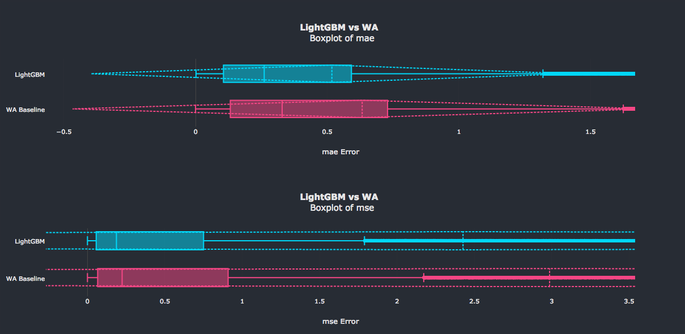

#### PRODUCT LEVEL
To inspect behavior on `product_id` level, we plot in-sample fits and out-of-fold predictions of the LightGBM model vs our baseline WA model. Some examples are shown below. Many products display intermittent demand and volatile behavior which is very challenging to capture.

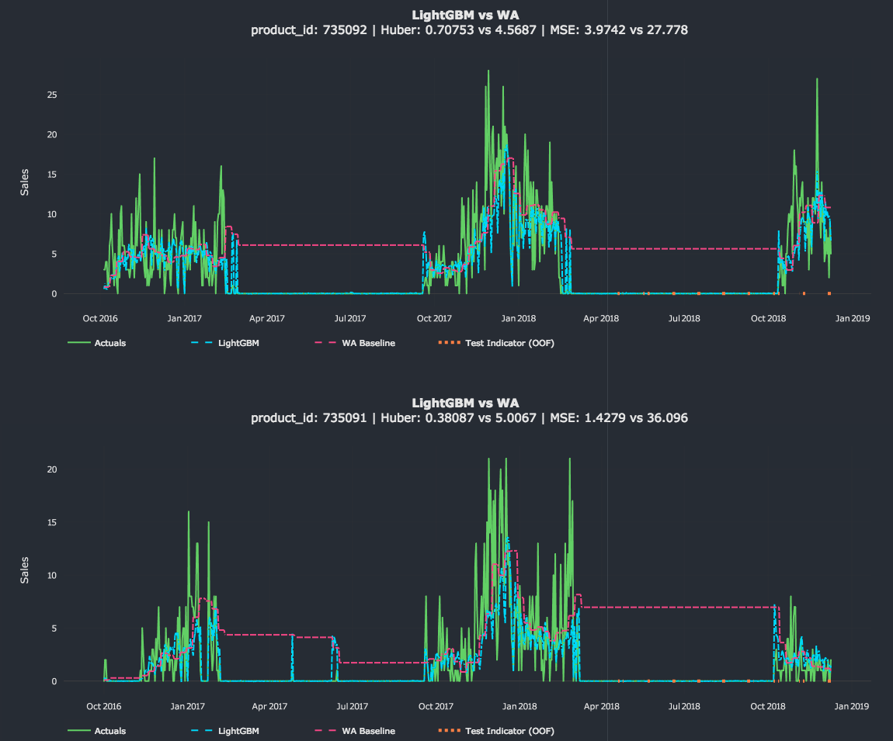
###### FIGURE 1: Seasonal products and out-of-stock in between seasons [electric blankets]

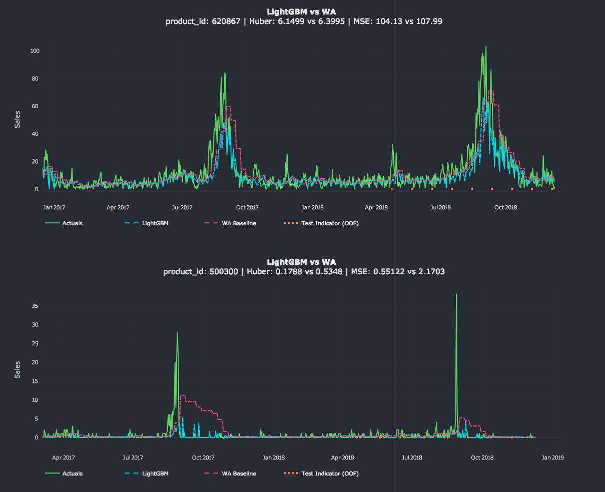
###### FIGURE 2: Seasonal products and out-of-stock in between seasons [school backpacks]  

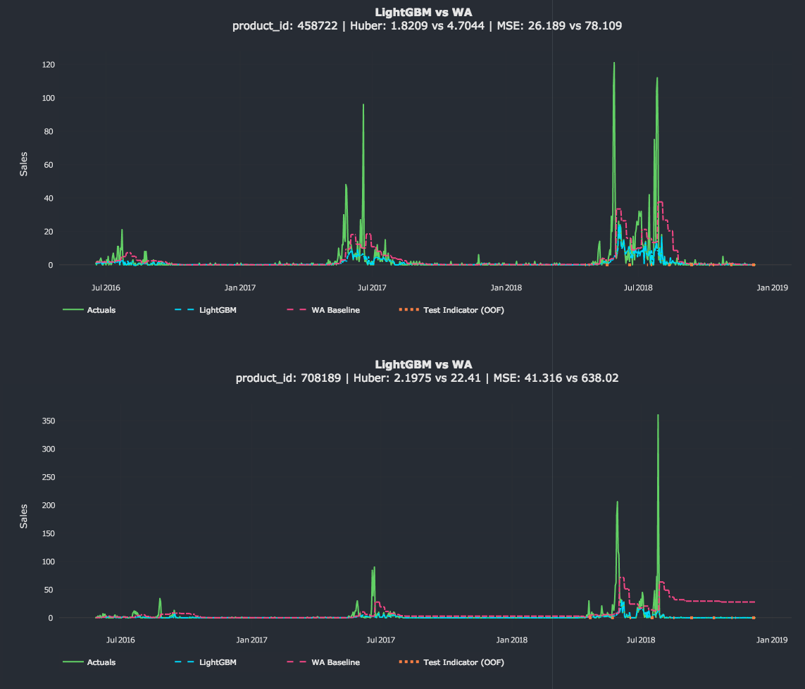
###### FIGURE 3: Seasonal products and out-of-stock in between seasons [fans]

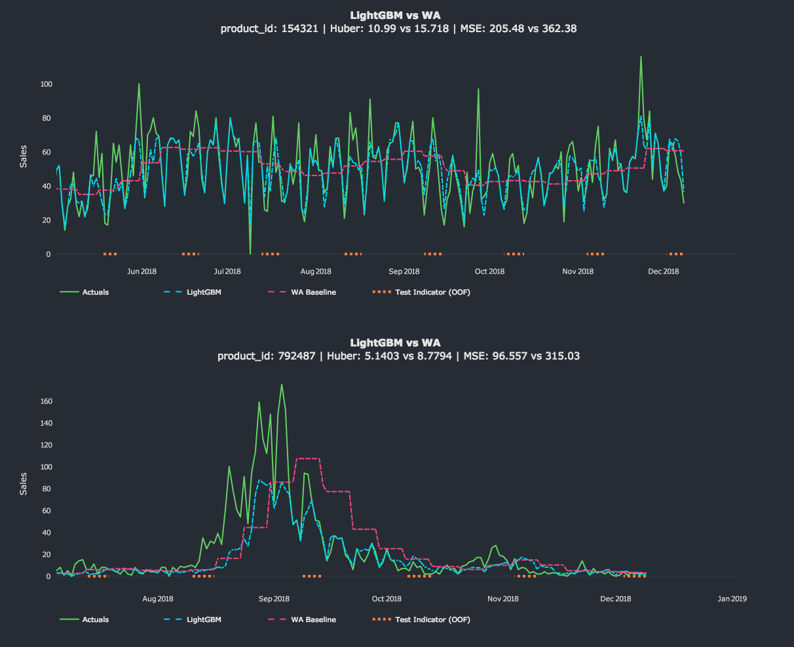
###### FIGURE 4: LightGBM picks up long term cycle, WA fails to capture any pattern [HDMI cable, top] WA fails to readjust after peak sales [calculator, bottom]

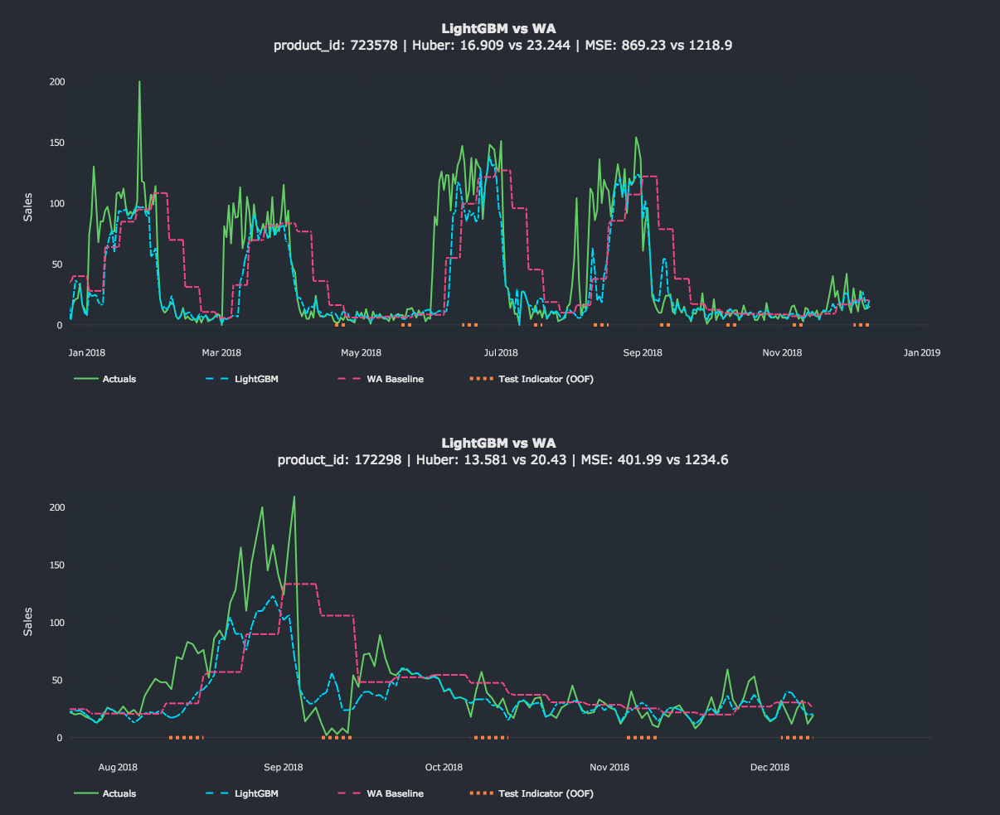
###### FIGURE 5: WA fails to readjust after peak sales [powerbank, top] [laptop sleeve, bottom] 

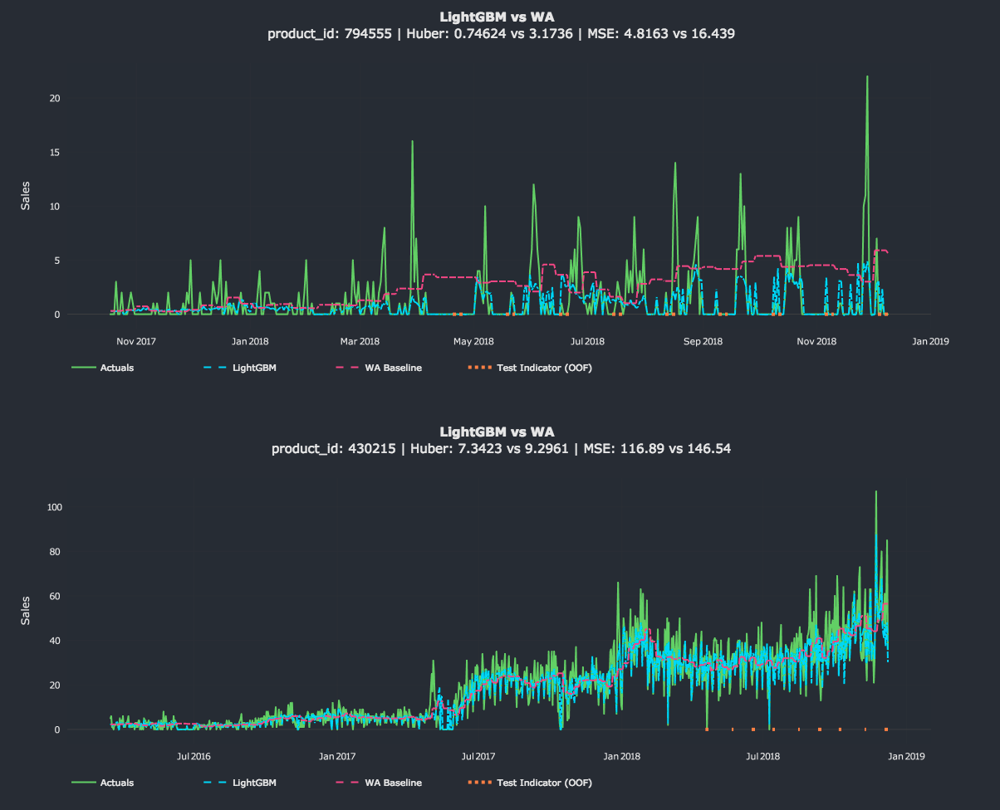
###### FIGURE 6: Long interval intermittent demand [waterfilter, top] LightGBM captures long term growth pattern washing machine table, bottom]

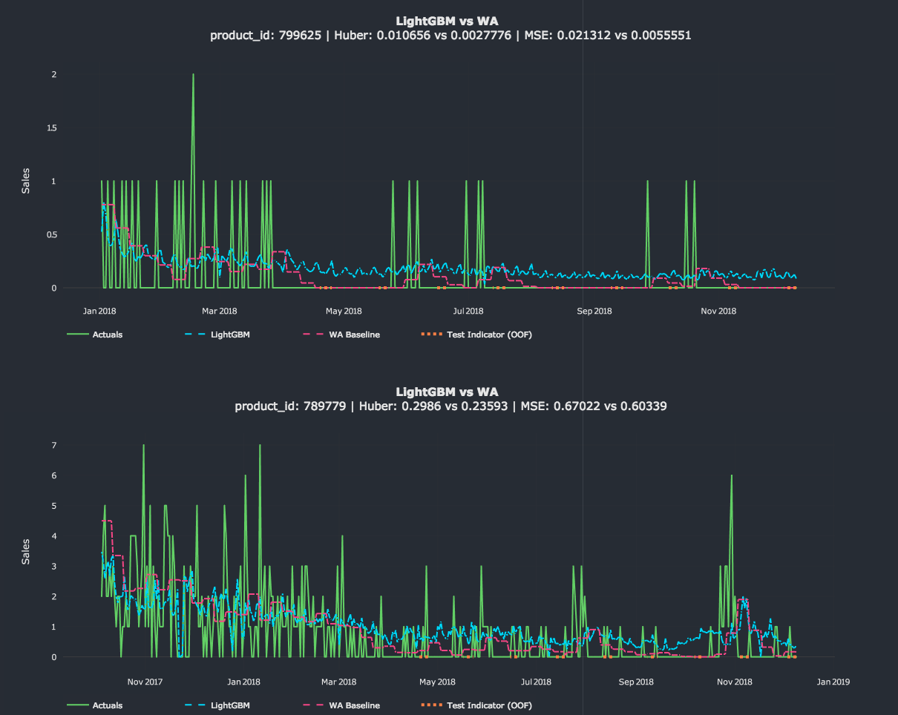
###### FIGURE 7: Short interval intermittent demand  [Xbox game, top] [? OOS, bottom]

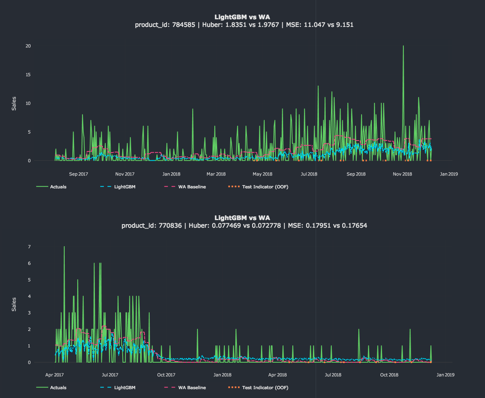
###### FIGURE 8: Short interval intermittent demand [smart thermo, top] long interval intermittent demand [ZenPad sleeve, bottom]

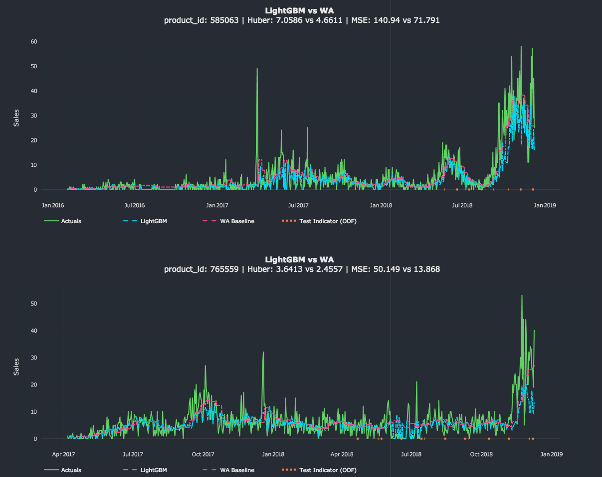
###### FIGURE 9: Strong deviations from stable long term behavior and volatility are hard to capture without features [washing machine top] [phone car-mount, bottom]

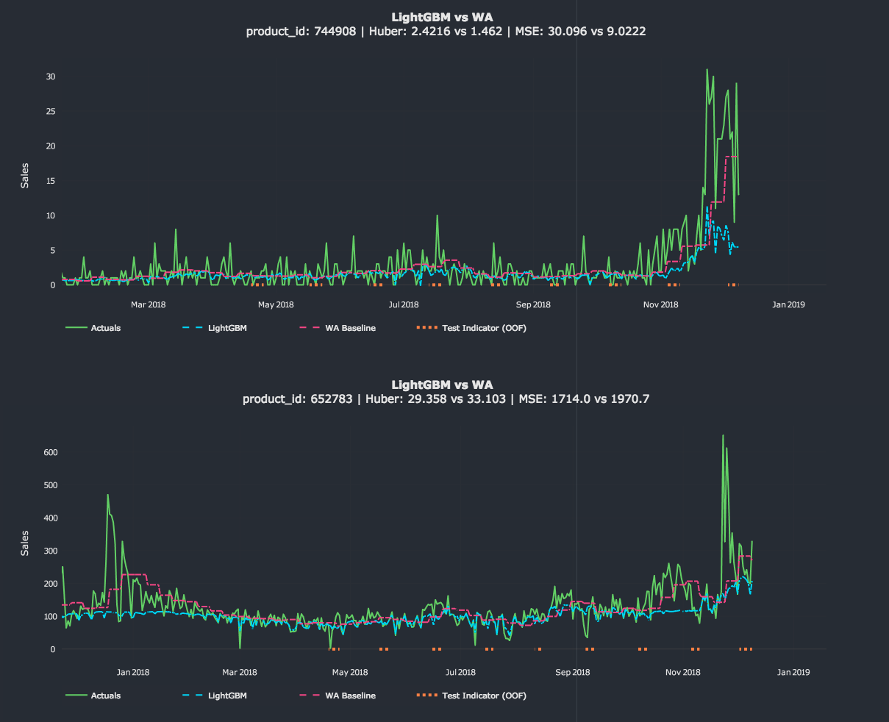
###### FIGURE 10: Strong deviations from stable long term behavior and volatility are hard to capture without features [Google chromecast v3, top] [Beats headphones, bottom]

---

### **`⚡`** FEATURES
Where the magic happens.

###### TABLE 4: Overview of top-25 contributing features
| Feature Name                     | Description                                                                 | Level        | Type  |
|----------------------------------|-----------------------------------------------------------------------------|--------------|-------|
| `weekday_mean_lag_wa_prod`       | mean of sales per weekday × WA forecast lag 7                               | `product_id` | *int* |
| `lag_7_mean`                     | rolling mean of sales lag 7 with 7 day window                               | `product_id` | *int* |
| `full_mean_lag_7_mean_prod`      | mean of sales overall × rolling mean of sales lag 7 with 7 day window       | `product_id` | *int* |
| `weekday_mean_lag_7_prod`        | mean of sales per weekday × sales lag 7                                     | `product_id` | *int* |
| `weekday_mean_lag_7_median_prod` | mean of sales per weekday × rolling median of sales lag 7 with 7 day window | `product_id` | *int* |
| `actual_weekday_mean`            | mean of sales per weekday                                                   | `product_id` | *int* |
| `lag_14_mean`                    | rolling mean of sales lag 14 with 14 day window                             | `product_id` | *int* |
| `full_mean_lag_wa_prod`          | mean of sales overall × WA forecast lag 7                                   | `product_id` | *int* |
| `lag_8_mean`                     | rolling mean of sales lag 8 with 8 day window                               | `product_id` | *int* |
| `lag_7_sum`                      | rolling sum of sales lag 7 with 7 day window                                | `product_id` | *int* |
| `dayofyear`                      | day of the year                                                             | global       | *cat* |
| `actual_full_mean`               | mean of sales overall                                                       | `product_id` | *int* |
| `lag_8`                          | sales lag 8                                                                 | `product_id` | *int* |
| `lag_7`                          | sales lag 7                                                                 | `product_id` | *int* |
| `lag_7_median`                   | rolling median of sales lag 7 with 7 day window                             | `product_id` | *int* |
| `lag_8_median`                   | rolling median of sales lag 8 with 8 day window                             | `product_id` | *int* |
| `subproduct_type_id`             | identifier of sub-product type                                              | `subproduct_type_id` | *int* |
| `weekday`                        | day of the week                                                             | global       | *cat* |
| `actual_full_var`                | variance of sales overall                                                   | `product_id` | *int* |
| `weekday_mean_lag_7_max_prod`    | mean of sales per weekday × rolling max of sales lag 7 with 7 day window    | `product_id` | *int* |
| `lag_14_median`                  | rolling median of sales lag 14 with 14 day window                           | `product_id` | *int* |
| `full_mean_lag_7_prod`           | mean of sales overall × sales lag 7                                         | `product_id` | *int* |
| `actual_full_median`             | median of sales overall                                                     | `product_id` | *int* |
| `lag_14_sum`                     | rolling sum of sales lag 14 with 14 day window                              | `product_id` | *int* |
| `product_group_id`               | identifier of product group                                                 | `product_group_id` | *cat* |

###### FIGURE 13: Shapley Value Attributions
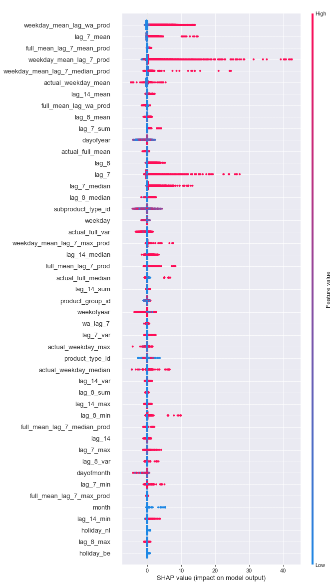
###### FIGURE 14: Gain (mean and standard deviation over folds)
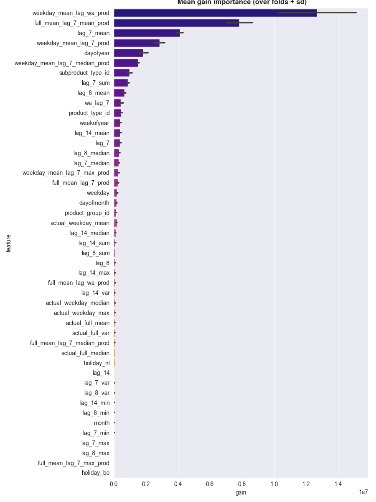
###### FIGURE 15: Split (mean and standard deviation over folds)
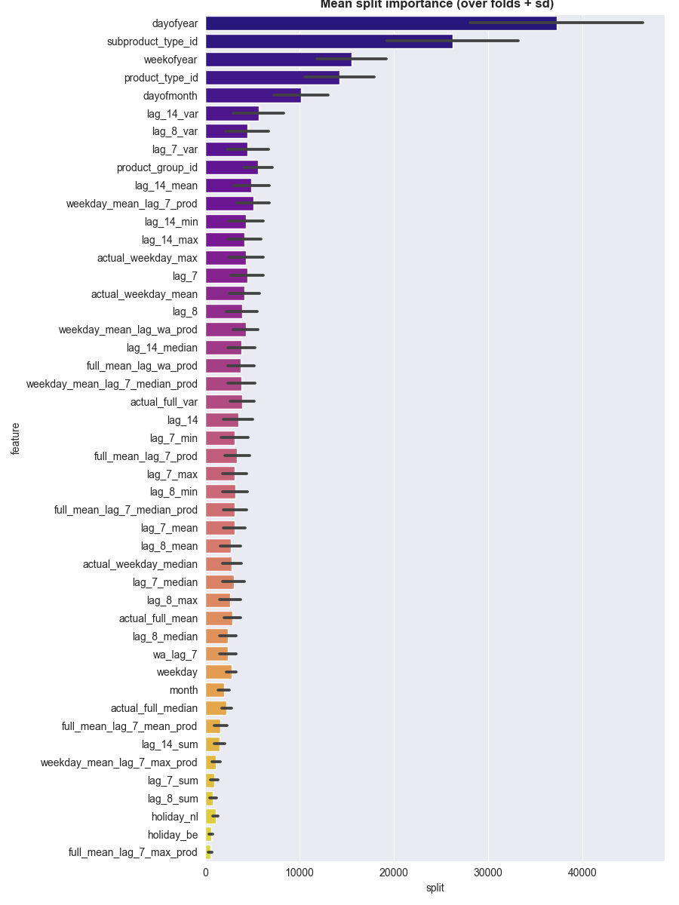

---

### **`⚡`** IMPROVEMENTS

###### FEATURE SUBSET
```py
['month' 'weekday' 'dayofmonth' 'weekofyear' 'dayofyear' 'holiday_nl'
 'holiday_be' 'lag_7' 'lag_7_min' 'lag_7_max' 'lag_7_mean' 'lag_7_median'
 'lag_7_sum' 'lag_7_var' 'lag_8' 'lag_8_min' 'lag_8_max' 'lag_8_mean'
 'lag_8_median' 'lag_8_sum' 'lag_8_var' 'lag_14' 'lag_14_min' 'lag_14_max'
 'lag_14_mean' 'lag_14_median' 'lag_14_sum' 'lag_14_var' 'wa_lag_7'
 'product_type_id' 'product_group_id' 'subproduct_type_id'
 'actual_full_mean' 'actual_full_median' 'actual_full_var'
 'actual_weekday_max' 'actual_weekday_median' 'actual_weekday_mean'
 'full_mean_lag_7_median_prod' 'full_mean_lag_7_mean_prod'
 'full_mean_lag_7_max_prod' 'weekday_mean_lag_7_median_prod'
 'weekday_mean_lag_7_max_prod' 'full_mean_lag_7_prod'
 'weekday_mean_lag_7_prod' 'full_mean_lag_wa_prod'
 'weekday_mean_lag_wa_prod']
```
###### HYPERPARAMETER SETTINGS

```py
PARAMS = {
    'nthread': 64, # Check if 32 is faster in prod (# real cores) see https://lightgbm.readthedocs.io/en/latest/Parameters.html
    'boosting_type': 'gbdt',
    'objective': 'huber', # Set to 'None' if custom objective is given in train call
    'metric': 'huber', # Set to 'None' if custom metric is given in train call
    'learning_rate': 0.15, # Train 1000+ rounds
    'max_depth': -1, # Unrestricted, increased from 24
    'min_data_in_leaf': 5, # Decreased from 20
    'num_leaves': 128, # Increased from 84
    'feature_fraction': 0.7, # Sample 70% of features
    'subsample': 1, # Was 0.9, use all data now
    'subsample_freq': 0,
    'max_bin': 4096, # Increased from 255
    'reg_alpha': 0.0, # No reg
    'reg_lambda': 0.0,
    'verbose': -1
}
```

###### INPUT/OUTPUT

* Removed unneccesary writing of objects and dataframes that are currently not used. For example, booster objects for every fold. Also remove overlapping observations due to growing train folds with a moving timeseries window. The first observation is preserved in the final results frame. This means that the correct in-sample train fit and out-of-fold test predictions are kept at any point in time.

* Found a parameter in the Google Python API to control chunk sizing for uploading and downloading to GCS. This significantly speeds up all up- and downloading. 

```
blob.chunk_size = 1 << 29 # Increased chunk size for faster downloading
```

###### RESULTS PROCESSING

* Current cross-validation for LightGBM setup has 8 folds with a testing period of 7 days in different months.
* WA forecast is being transformed to be constant for 7 days. This yields a 7 day ahead forecast that is not updated every day but every 7 days.
* Transformation is done based on the test fold such that the the first days of the week are selected and propogated through for each `product_id` / `fold` combination.
* This also means that results are computed based on this fair 7 day ahead performance for both LightGBM as WA resulting in a fair comparison. This resembles the actual production situation.
* The transformation function is shown below, this can probably be speed up by using `.iloc[::7, ]` to select every 7th row (including 0th) in a vectorized way. Instead of resetting index for every grouping combination and then finding all the index locations that are not divisible by 7.

```py
# Create a DF that only covers the test periods
# We may not have WA for all dates within test, so drop those that don't
# Daily updated forecast is transformed to a 7-day ahead forecast starting from each first day in each testing fold
test_df = results_df[results_df['is_test'] == True]

# Using test_df.iloc[::7, ] to select every 7th row (including 0) inside a group may offer a faster solution
def transform_to_weekly_wa(test_df):
    """
    Select all rows in the test set that are not divisible by 7 (these are the first days of the weeks)
    Set all but the first days of the week to 0, then fill all NaN's with a forwardfill
    This propogates the first forecasted value of the week to all consecutive days in that week
    The end result is a fair 7-day ahead forecast for each week which is updated every 7 days
    """
    test_df['wa'][test_df.reset_index(drop=True).index % 7 != 0] = np.NaN
    test_df.fillna(method='ffill', inplace=True)
    return test_df

print('Transforming WA forecast to weekly predictions ...')
# Ensure to not propogate values across different folds for a product by also grouping by fold!
test_df = test_df.groupby(['product_id', 'fold']).apply(transform_to_weekly_wa)
```
###### PLOTTING

* Feature importance plots are summarized into a single plot over all folds. The plot includes a standard deviation to quickly see variation of a feature across the folds. This replaces the feature importance plots for each seperate fold.
* Individual plotting of a product to compare behavior of the WA and LightGBM model now supports the entire result dataframe as input. 
* All in-sample fits and test predictions across fold are correctly visualized at each point in time in a single plot. 
* WA forecast is visualized as a 7 day ahead forecast.
* Testing folds are shown with an indicator automatically based on the `is_test` column in the data. Hence, the plot will adapt to any changes in the cross-validation setup. Metrics are automatically computed and displayed for the selected product based on the out-of-fold predictions and taking into account a 7 day ahead WA forecast. 

---

### **`⚡`** WHAT DID NOT WORK (YET)

###### CATEGORICAL FEATURES
Not all available categorical features add predictive power such as `product_group_id`, `team_id`, `brand_id` or `manufacturer_id`. I expect that an explanation is that these hierarchies are based completely on item similarity. Item similarity does not directly imply similarity in sales behavior which is what the model needs. There are quite some interesting possibilities to be explored in this area. For example, we could consider clustering algorithms to group out products with similar behavior and use this grouping as a feature instead of the existing groupings where behavior is not taken into account. 

###### HOLIDAYS
Holidays and events are always challenging due to data sparsity and changing impacts each year. Simple dummy for holidays and 5-day windows around do not help the model. We most likely need more sophisticated features to pick up patterns in different holidays and events.

###### LAGS
Including many lags such as `[9, 10, 11, 12, 13]` for all products adds no value. Also, longer lags by themself have no predictive power such as lag 21 or 28.

###### AGGREGATIONS
All features based on a different grouping structure then `product_id` do not improve performance. For example, features based on sales aggregated over a grouping hierarchy like `product_type_id` or `subproduct_type_id`. I expect that an explanation is that these hierarchies are based completely on item similarity. Item similarity does not directly imply similarity in sales behavior which is what the model needs. There are quite some interesting possibilities to be explored in this area. For example, we could consider clustering algorithms to group out products with similar behavior and use this grouping as a feature instead of the existing groupings where behavior is not taken into account. 

###### TARGET ENCODING
Solves the issue of One-Hot-Encoding of high cardinality features which can lead to unstable results in decision tree models. 

No performance increases were achieved with vanilla target encoding on several high cardinality categorical features such as `product_id`, `product_type_id`, `subproduct_type_id` or `product_group_id` etc. Most likely due to the grouping hierarchy not having enough structure in terms of similar behavior of product within this group. Moreover, some of our features can already be interpreted as a form of target encoding. For example, features such as `actual_weekday_mean` and `lag_7_mean` include the (historical) target for a `product_id`. A fast implementation is given below which may be used for future experiments.

```py
def target_encoder(df, column, target, index=None, method='mean'):
    """
    Target-based encoding is numerization of a categorical variables via the target variable. Main purpose is to deal
    with high cardinality categorical features without exploding dimensionality. This replaces the categorical variable
    with just one new numerical variable. Each category or level of the categorical variable is represented by a
    summary statistic of the target for that level.

    Args:
        df (pandas df): Pandas DataFrame containing the categorical column and target.
        column (str): Categorical variable column to be encoded.
        target (str): Target on which to encode.
        index (arr): Can be supplied to use targets only from the train index. Avoids data leakage from the test fold
        method (str): Summary statistic of the target. Mean, median or std. deviation.

    Returns:
        arr: Encoded categorical column.

    """

    index = df.index if index is None else index # Encode the entire input df if no specific indices is supplied

    if method == 'mean':
        encoded_column = df[column].map(df.iloc[index].groupby(column)[target].mean())
    elif method == 'median':
        encoded_column = df[column].map(df.iloc[index].groupby(column)[target].median())
    elif method == 'std':
        encoded_column = df[column].map(df.iloc[index].groupby(column)[target].std())
    else:
        raise ValueError("Incorrect method supplied: '{}'. Must be one of 'mean', 'median', 'std'".format(method))

    return encoded_column
```

###### USER SESSION DATA
Adding the page hits on `product_id` level does not help the model. This might very well be because there is a partly stochastic process behind attributing user sessions to specific products which makes the signal noisy. This is indicated in the data with an `enrichment_` suffix. Still, there might be valuable information in our user session data. For example page-views or adding a product to the basket but not buying yet etc.

###### TSFRESH FEATURES
A quick test to include a large list of generated features from the [tsfresh](https://tsfresh.readthedocs.io/en/latest/text/list_of_features.html) package does not improve performance. However, there might be some interesting ideas in here such as including the number of peaks for a `product_id` as a feature.

### **`⚡`** FULL LOGS

###### 10K SUBSET
Performance on a subset of the 10.000 most recent products in the data. Note that running time includes cross-validation, thus the model is trained on a growing dataframe of 8 folds.

`Runtime:` 1 hr 25 min

```py
[+] Fold 0 from 2018-04-20 to 2018-04-27
Huber	| LightGBM: 0.29196		Weighted Average: 0.3824
MSE	| LightGBM: 1.6758		Weighted Average: 2.3742
MAE	| LightGBM: 0.48508		Weighted Average: 0.61094
MAPE	| LightGBM: 0.22757		Weighted Average: 0.34807
WMAPE	| LightGBM: 0.72663		Weighted Average: 0.91516
[+] Fold 1 from 2018-05-18 to 2018-05-25
Huber	| LightGBM: 0.32962		Weighted Average: 0.38988
MSE	| LightGBM: 1.9937		Weighted Average: 2.2061
MAE	| LightGBM: 0.52977		Weighted Average: 0.62728
MAPE	| LightGBM: 0.22847		Weighted Average: 0.33322
WMAPE	| LightGBM: 0.69985		Weighted Average: 0.82867
[+] Fold 2 from 2018-06-15 to 2018-06-23
Huber	| LightGBM: 0.34388		Weighted Average: 0.41901
MSE	| LightGBM: 2.5275		Weighted Average: 2.6976
MAE	| LightGBM: 0.5472		Weighted Average: 0.66861
MAPE	| LightGBM: 0.23418		Weighted Average: 0.36489
WMAPE	| LightGBM: 0.64294		Weighted Average: 0.7856
[+] Fold 3 from 2018-07-14 to 2018-07-21
Huber	| LightGBM: 0.34935		Weighted Average: 0.40113
MSE	| LightGBM: 4.2132		Weighted Average: 3.764
MAE	| LightGBM: 0.55209		Weighted Average: 0.63891
MAPE	| LightGBM: 0.22824		Weighted Average: 0.33267
WMAPE	| LightGBM: 0.67623		Weighted Average: 0.78258
[+] Fold 4 from 2018-08-11 to 2018-08-18
Huber	| LightGBM: 0.32778		Weighted Average: 0.38594
MSE	| LightGBM: 2.6879		Weighted Average: 3.0995
MAE	| LightGBM: 0.52605		Weighted Average: 0.61514
MAPE	| LightGBM: 0.22081		Weighted Average: 0.32607
WMAPE	| LightGBM: 0.68239		Weighted Average: 0.79796
[+] Fold 5 from 2018-09-08 to 2018-09-15
Huber	| LightGBM: 0.32414		Weighted Average: 0.40843
MSE | LightGBM: 2.44720		Weighted Average: 3.7849
MAE | LightGBM: 0.51623		Weighted Average: 0.64049
MAPE | LightGBM: 0.21827		Weighted Average: 0.34416
WMAPE	| LightGBM: 0.67760		Weighted Average: 0.8407
[+] Fold 6 from 2018-10-07 to 2018-10-14
Huber	| LightGBM: 0.28966		Weighted Average: 0.35772
MSE | LightGBM: 1.90400		Weighted Average: 2.1361
MAE | LightGBM: 0.47985		Weighted Average: 0.5815
MAPE | LightGBM: 0.22256		Weighted Average: 0.32596
WMAPE	| LightGBM: 0.70449		Weighted Average: 0.85372
[+] Fold 7 from 2018-11-04 to 2018-11-11
Huber	| LightGBM: 0.28427		Weighted Average: 0.34643
MSE | LightGBM: 1.70820		Weighted Average: 2.4631
MAE | LightGBM: 0.47277		Weighted Average: 0.56436
MAPE | LightGBM: 0.22027		Weighted Average: 0.31158
WMAPE	| LightGBM: 0.69433		Weighted Average: 0.82884
[+] Fold 8 from 2018-12-02 to 2018-12-09
Huber	| LightGBM: 0.34622		Weighted Average: 0.47997
MSE | LightGBM: 3.39820		Weighted Average: 5.1877
MAE | LightGBM: 0.53977		Weighted Average: 0.70924
MAPE | LightGBM: 0.23194		Weighted Average: 0.36084
WMAPE | LightGBM: 0.68674		Weighted Average: 0.90235

[+] Product Group Metrics
Products in OOS group: 508, products in Promo group: 111, Products in Normal group: 1252
OOS product types overall metrics [LGBM, WA] 
 Huber | LightGBM: 0.12564 	Weighted Average: 0.21079 
 MSE | LightGBM: 4.68910	 Weighted Average: 5.533 
 MAE | LightGBM: 0.21722	 Weighted Average: 0.32281 
 MAPE | LightGBM: 0.10119	 Weighted Average: 0.19905 
 wMAPE | LightGBM: 0.87000	 Weighted Average: 1.2929
Promo product types overall metrics [LGBM, WA] 
 Huber | LightGBM: 1.2590	Weighted Average: 1.6106 
 MSE | LightGBM: 18.3610	  Weighted Average: 26.254 
 MAE | LightGBM: 1.57830	  Weighted Average: 1.9845 
 MAPE | LightGBM: 0.40159	 Weighted Average: 0.66986 
 wMAPE | LightGBM: 0.52138	 Weighted Average: 0.65558
Normal product types overall metrics [LGBM, WA] 
 Huber | LightGBM: 0.14309	 Weighted Average: 0.17027 
 MSE | LightGBM: 0.57595	 Weighted Average: 0.6336 
 MAE | LightGBM: 0.29070	 Weighted Average: 0.33377 
 MAPE | LightGBM: 0.16452	 Weighted Average: 0.21277 
 wMAPE | LightGBM: 0.90595	 Weighted Average: 1.0402
```

###### 40K SUBSET
Performance on a subset of the 40.000 most recent products in the data. This includes all the products that would currently be included in the production setting. Note that running time includes cross-validation, thus the model is trained on a growing dataframe of 8 folds. Production situation consist of only a single fold and speed should be very similar to that of the most recent fold. This train fold is all data back to 2016 and a test fold of 7 days for all products. 

`Runtime:` 3 hr 28 min

`Training time last fold + prediction:` 29 min

```py
[+] Fold 0 from 2018-04-18 to 2018-04-25
Huber	| LightGBM: 0.33777		Weighted Average: 0.40496
MSE	| LightGBM: 2.312		Weighted Average: 2.6412
MAE	| LightGBM: 0.5353		Weighted Average: 0.63609
MAPE | LightGBM: 0.27425		Weighted Average: 0.37967
WMAPE	| LightGBM: 0.81908		Weighted Average: 0.97331
[+] Fold 1 from 2018-05-17 to 2018-05-24
Huber	| LightGBM: 0.31611		Weighted Average: 0.38797
MSE	| LightGBM: 1.9464		Weighted Average: 2.2633
MAE	| LightGBM: 0.51433		Weighted Average: 0.62455
MAPE	| LightGBM: 0.22614		Weighted Average: 0.33839
WMAPE	| LightGBM: 0.69329		Weighted Average: 0.84185
[+] Fold 2 from 2018-06-14 to 2018-06-21
Huber	| LightGBM: 0.34718		Weighted Average: 0.42886
MSE	| LightGBM: 2.5155		Weighted Average: 2.8945
MAE	| LightGBM: 0.5486		Weighted Average: 0.67995
MAPE	| LightGBM: 0.23166		Weighted Average: 0.37432
WMAPE	| LightGBM: 0.64805		Weighted Average: 0.80322
[+] Fold 3 from 2018-07-13 to 2018-07-20
Huber	| LightGBM: 0.34718		Weighted Average: 0.39973
MSE	| LightGBM: 3.5211		Weighted Average: 3.289
MAE	| LightGBM: 0.5527		Weighted Average: 0.63812
MAPE	| LightGBM: 0.23422		Weighted Average: 0.33888
WMAPE	| LightGBM: 0.67255		Weighted Average: 0.77649
[+] Fold 4 from 2018-08-10 to 2018-08-17
Huber	| LightGBM: 0.31646		Weighted Average: 0.37795
MSE	| LightGBM: 2.1706		Weighted Average: 2.5558
MAE	| LightGBM: 0.51563		Weighted Average: 0.60929
MAPE	| LightGBM: 0.22188		Weighted Average: 0.332
WMAPE	| LightGBM: 0.68754		Weighted Average: 0.81243
[+] Fold 5 from 2018-09-08 to 2018-09-15
Huber	| LightGBM: 0.3198		Weighted Average: 0.41223
MSE	| LightGBM: 2.3065		Weighted Average: 3.4659
MAE	| LightGBM: 0.51211		Weighted Average: 0.64619
MAPE	| LightGBM: 0.21846		Weighted Average: 0.35251
WMAPE	| LightGBM: 0.67796		Weighted Average: 0.85545
[+] Fold 6 from 2018-10-06 to 2018-10-13
Huber	| LightGBM: 0.28296		Weighted Average: 0.36411
MSE	| LightGBM: 1.7473		Weighted Average: 2.1496
MAE	| LightGBM: 0.47171		Weighted Average: 0.58848
MAPE	| LightGBM: 0.22065		Weighted Average: 0.33593
WMAPE	| LightGBM: 0.70688		Weighted Average: 0.88186
[+] Fold 7 from 2018-11-04 to 2018-11-11
Huber	| LightGBM: 0.29015		Weighted Average: 0.35519
MSE	| LightGBM: 1.9376		Weighted Average: 2.449
MAE	| LightGBM: 0.4781		Weighted Average: 0.57366
MAPE	| LightGBM: 0.22139		Weighted Average: 0.31892
WMAPE	| LightGBM: 0.70307		Weighted Average: 0.84359
[+] Fold 8 from 2018-12-02 to 2018-12-09
Huber	| LightGBM: 0.34278		Weighted Average: 0.47583
MSE	| LightGBM: 3.4255		Weighted Average: 5.2007
MAE	| LightGBM: 0.53661		Weighted Average: 0.70549
MAPE	| LightGBM: 0.23109		Weighted Average: 0.36341
WMAPE | LightGBM: 0.68468		Weighted Average: 0.90016

[+] Product Group Metrics
Products in OOS group: 1139, products in Promo group: 235, Products in Normal group: 2895
OOS product types overall metrics [LGBM, WA] 
 Huber | LightGBM: 0.10201		Weighted Average: 0.17109 
 MSE | LightGBM: 2.1857		Weighted Average: 3.2118 
 MAE | LightGBM: 0.19404		Weighted Average: 0.28386 
 MAPE | LightGBM: 0.10225		Weighted Average: 0.18733 
 wMAPE | LightGBM:  0.94869		Weighted Average: 1.3879
Promo product types overall metrics [LGBM, WA] 
 Huber | LightGBM: 1.0773		Weighted Average: 1.3375 
 MSE | LightGBM: 15.786		Weighted Average: 19.864 
 MAE | LightGBM: 1.3777		Weighted Average: 1.6981 
 MAPE | LightGBM: 0.39378		Weighted Average: 0.65377 
 wMAPE | LightGBM: 0.5307		Weighted Average: 0.65412
Normal product types overall metrics [LGBM, WA] 
 Huber | LightGBM: 0.14455		Weighted Average: 0.17542 
 MSE | LightGBM: 0.58096		Weighted Average: 0.66982 
 MAE | LightGBM: 0.29267		Weighted Average: 0.33862 
 MAPE | LightGBM: 0.16767		Weighted Average: 0.21812 
 wMAPE | LightGBM: 0.91586		Weighted Average: 1.0597
```
